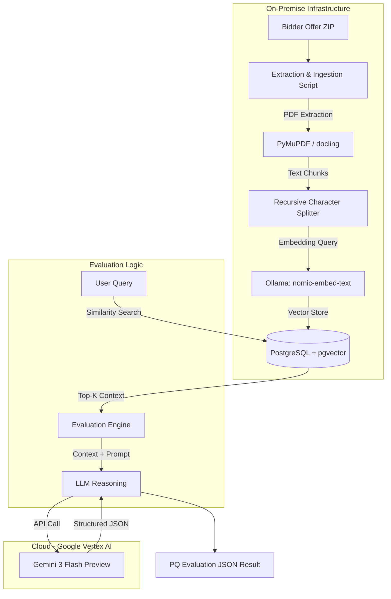

# System Architecture: AI Tender Evaluator

This document outlines the technical architecture, data flow, and component interaction for the AI-based Tender Evaluation Engine.

## Overview

The system is a high-performance RAG (Retrieval-Augmented Generation) pipeline designed to analyze complex bidder offers (500+ page PDFs) and generate structured, audit-ready evaluation results. It leverages a hybrid approach: **local infrastructure** for privacy-sensitive data processing and **cloud-based reasoning** for advanced interpretation.

## Component Diagram

## Technical Components

### 1. Ingestion & Vector Storage
- **PDF Extraction**: Uses `PyMuPDF` (fitz) for lightweight and fast text extraction. Support for `docling` is included for advanced OCR tasks.
- **Embedding Model**: `nomic-embed-text` running locally on **Ollama**. This ensures that raw text never leaves the local environment for vectorization.
- **Vector Database**: **PostgreSQL 16** with the `pgvector` extension, running via Docker on host port **5444**.
- **Chunking Strategy**: Recursive character splitting with a chunk size of 1000 characters and 200-character overlap to preserve semantic context across page boundaries.

### 2. Reasoning & Evaluation
- **Orchestration**: Python-based engine using `LangChain` primitives for retrieval and prompt management.
- **LLM Engine**: **Gemini 3 Flash (Preview)** via Google's Generative AI SDK, providing state-of-the-art reasoning with high throughput.
- **Structured Output**: **Pydantic** models enforce a strict JSON schema (`PQEvaluationResult`) for the LLM response, ensuring machine-readability for integration with local TMS.

### 3. Data Flow
1. **Extraction**: The ZIP file is unpacked; all PDFs are parsed into raw text.
2. **Indexing**: Text is chunked, embedded via Ollama, and metadata (bidder name, source page) is stored in pgvector.
3. **Retrieval**: User queries are embedded and compared against the vector store using cosine similarity to find the most relevant document sections.
4. **Augmentation**: The reasoning engine (Gemini) receives the user query along with the top retrieved chunks.
5. **Generation**: Gemini generates a structured evaluation covering technical deviations, risks, and final recommendations.

## Security & Privacy
- **Data Residency**: The primary text data and semantic vectors stay on the organization's local infrastructure.
- **Cloud Minimalist**: Only the specific text chunks relevant to the query are sent to the cloud (Vertex AI) for reasoning, significantly reducing data exposure compared to uploading entire documents.
- **Authentication**: Secured via Google Cloud API keys and environment-level project configurations.

## Setup Requirements
- **Docker**: For running the pgvector container.
- **Ollama**: For running local embeddings.
- **Python 3.14+**: Current runtime environment.
- **Google Cloud Project**: For Vertex AI / Gemini 3 access.
